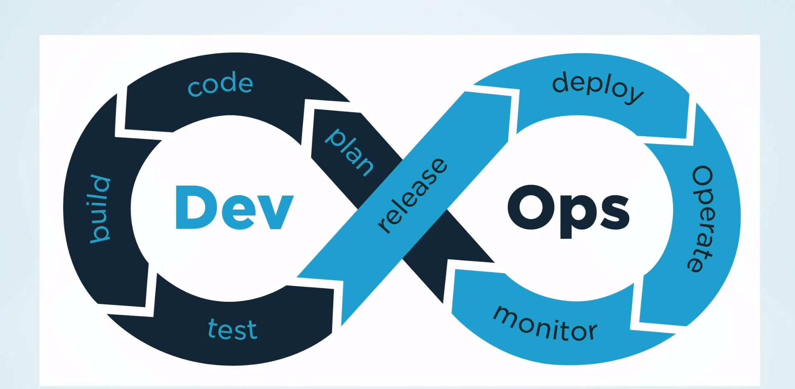

At this stage, you would have got an idea on what was the problem occuring previously, such that there was a delay in the Software release. As previously mentioned, DevOps focuses on reducing each barrier that leads to delay in the new release of a Software. 

*But How? What is DevOps? How it is solving the problem of conflict between Development Team & Operation Team?*

DevOps is a combination of Cultural Philosophies, Practices and tools combined together. Basically anything that creates the process of releasing the software fast with high quality. **The main part was that Devs and Ops Team should work together more often.**

In Simple words, DevOps refers to the set of practices which focuses on reducing each barrier that leads to delay in the release of Software by automating the process. The Key part in DevOps is that 'Both Development & Operations Team works together to reduce any type of conflict.'

## Challenges that DevOps tries to solve:

**1. Lack of communication between Development & Operations Team:** Most of the time, it happens that developers have written the code & sent it to the operations team to deploy it on server. But Operations team fails to do so because of various reasons - Production servers crashed, new bugs being introduced while deploying etc. Hence Operations team send the code back to the Development team to improve it. Hence a delay happens for the next release.

**2. Conflict of Interest:** Although the end goal of both Development & Operations team is to make the application available to the user yet the conflict of interest happens. Development team mostly focuses on writing quality code and improving, adding new features whereas Operations team mostly focuses on system reliability. 

**3.Security issues:** Although Security team focuses upon security issues yet Operations team also focuses on maintaining the system security. This process also leads to delay in the release process.

DevOps try to remove all these processes that slows down the release of a software. Hence a new term called as *DevSecOps* is introduced just to remind that Security issues also needs to be automated as well so that the release can happen on time.

**4. Manual work:** There are a lot of manual work that is done which can include manually configuring the server, manually deploying an application and so much more, which again leads to delay in the release process.  The manual work that is done might lead to error in the infrastructue which would be difficult to resolve. Apart from that, knowledge sharing is difficult.

 Suppose a person did some manual work. In order to understand the manual work that person has done, he/she has to document it as well which still may not be a confirmed way of understanding how the work has been done.

*One of the question that bothered me was How did this cultural practices lead to the creation of a new job called as 'DevOps Engineer'?*

Think of it.

Here's the answer:

Who's the father of DevOps? 
 Patrick Debois

 Let's try to get deep in the term DevOps from the next slide. But for now, Do you have an answer to the following questions now?

 1. What is DevOps?
 2. What is the problem that DevOps is solving?

Apart from reading this, I'd highly recommend folks to go through [this](https://youtu.be/0yWAtQ6wYNM) amazing video by Tech with Nana.
