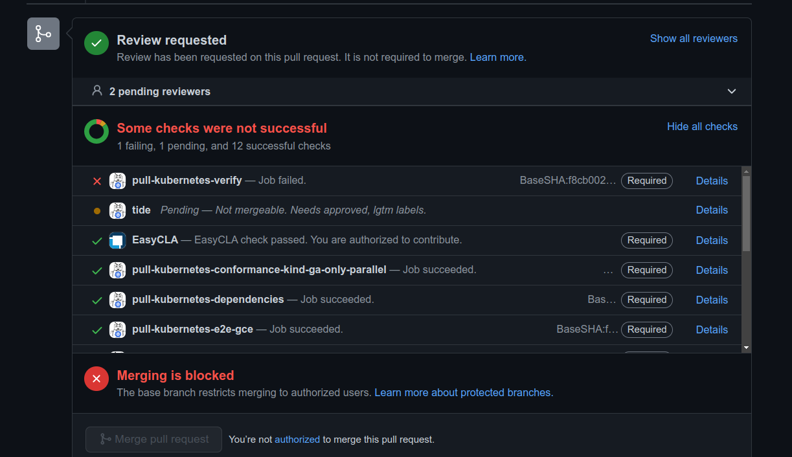

Continuous Integration(CI) is a DevOps practice that is followed in order to avoid situations like Merge Conflicts and confusion while working in the team. However, CI is not as easy as it sounds like. Let's take a look at what used to happend before the concept of CI was introduced.

Let's take two developers me and you who are writing some code in production. I'm working under my work environment whereas you're working under your work environment. You're unaware of what changes I'm doing whereas I'm unaware of what changes you make in the code base. Suppose, I modified the line number 6 in a file whereas you deleted the line number 6 in the same file in your environment. According to me, my changes are correct whereas according to you, your changes are correct. 

After the tes-cases are successful, I commit the code and push it to the central repository. Similarly you also do the same. This leads to a problem which is often referred as Merge Conflicts. Let's take the example of VCS such as Git. If you and I make changes on the same line, git will get confused on which changes to actually take. In brief, git will be like "Do you want me to take your changes or Nitish's changes?" In order to solve Merge conflicts, we'll have to manually edit the file with the changes we'd like to presist in the codebase.

This is only a small scenariou between me and you. In production there large number of files with large number of people working on the codebase and pushing the code everyday. Imagine, getting a large number of such Merge Conflicts like that. Would you like it? No, right?

Comes into action Continuous Integration(CI) that solves this problem. Whenever a developer pushes the code to the central repository after the Test-Cases have been successfully locally, an automated tool is used such as Jenkins, GitHub Actions which takes in the new code that has been pushed, performs various checks and various types of testing to ensure whether there are any errors or bug found or not. If there are any errors found in the overall codebase, the autmated system sends the message to the developer/team regarding error and to fix it immediately. Sometimes these checks are performed once the code has been merged. Often, the checks are performed at the time when new changes have been pushed.

This automated system helps to avoid Merge Conflicts as well as delay in the Software release. 

**But we do have code editors that checks the build of our code-base. Then why do we need continuous Integration?**

Code editors can check syntax and simple errors in your code, but they do not provide a comprehensive evaluation of your code base. Continuous integration goes beyond just syntax and error checking, it includes various activities like automated building, testing, and deployment of code changes. This helps to catch issues early in the development cycle, identify and resolve conflicts between different code changes, and ensure that the code base remains stable and functional. Moreover, CI systems can provide a centralized platform for tracking and monitoring changes in the codebase and testing results, making it easier for teams to collaborate and improve the overall quality of the software.

If you'd like to see this in practical, I'd highly recommend you to go through some of the PRs in the [Kubernetes](https://github.com/kubernetes/kubernetes/pulls) repository on GitHub. 

Look at the image below displaying the CI checks for one of the PR

The contributor would have pushed the code only after the checks were successful in his/her local environment (via code editor build). However, as soon as the new changes were applied, the code changes were taken in by CI and overall build was run along with number of test cases due to which one of the check fails indicating that this code is not preferred to be mereged. All this information is visible to the developer/contributor who made these changes as well. Hence, the developer can make some changes to resolve the checks.